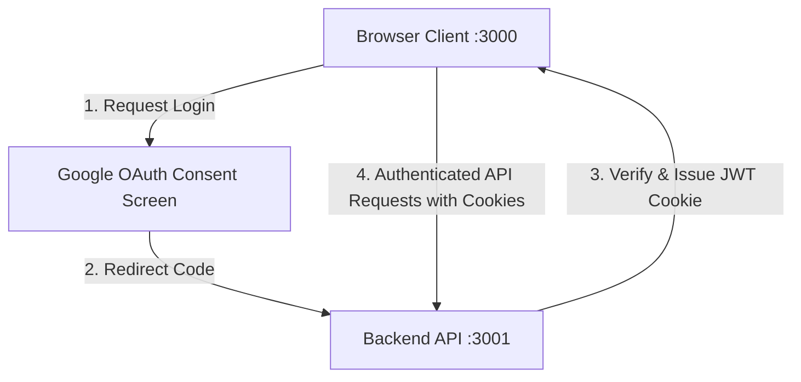

# Technical Council Website - IIT Gandhinagar

This repository contains the official website for the Technical Council of IIT Gandhinagar, structured as a decoupled application:
1. **Frontend**: A Next.js App Router application configured for static HTML export (`output: "export"`).
2. **Backend**: A Next.js App Router server/API application that manages database operations, admin dashboards, and custom Google OAuth sessions.

---

## 🏛️ Architecture Overview



- **Authentication**: Custom backend-only Google OAuth2 with secure `HttpOnly` JWT session cookies (`admin_session`).
- **Decoupling**: The static frontend makes client-side requests using standard `fetch` with `credentials: "include"` to allow the browser to forward credentials.
- **Admin Verification**: Authorization is based on a dynamic authorized admin email list fetched from storage, fallback emails, and domain filters (`@iitgn.ac.in`).

---

## ⚙️ Google Cloud Console OAuth Configuration

To configure Google Sign-In for the administration panel, follow these steps:

1. Go to the [Google Cloud Console](https://console.cloud.google.com/).
2. Select your project (or create a new one).
3. Open the **API & Services** dashboard and navigate to the **OAuth consent screen** tab:
   - Choose **External** user type.
   - Enter your App information (App name, support email, developer contact details).
   - Under **Scopes**, add `openid`, `.../auth/userinfo.email`, and `.../auth/userinfo.profile`.
   - Add test users (your email) if the app is in "Testing" publishing status.
4. Go to the **Credentials** tab:
   - Click **Create Credentials** -> **OAuth client ID**.
   - Select **Web application** as the application type.
   - **Authorized JavaScript origins**:
     - *Development*: `http://localhost:3000`, `http://localhost:3001`
     - *Production*: Add your public frontend and backend domain URLs (e.g., `https://tech.iitgn.ac.in`).
   - **Authorized redirect URIs**:
     - *Development*: `http://localhost:3001/api/auth/callback`
     - *Production*: `https://api.yourdomain.com/api/auth/callback` (Must match your backend production domain).
5. Click **Create** and copy your **Client ID** and **Client Secret**.

---

## 🔑 Environment Variables Configuration

Create `.env` files in both the `frontend` and `backend` directories.

### Backend Environment Variables (`backend/.env`)

| Variable | Description | Development | Production |
| :--- | :--- | :--- | :--- |
| `DATABASE_URL` | PostgreSQL connection string | Local/Neon connection | Production Neon Database connection |
| `GOOGLE_CLIENT_ID` | Google OAuth Client ID | `xxx.apps.googleusercontent.com` | `xxx.apps.googleusercontent.com` |
| `GOOGLE_CLIENT_SECRET` | Google OAuth Client Secret | `GOCSPX-xxxx` | `GOCSPX-xxxx` |
| `NEXTAUTH_SECRET` | 32+ character random string for signing JWTs | `tech-web-iitgn-dev-secret` | Generate a secure phrase (e.g. `openssl rand -base64 32`) |
| `FRONTEND_URL` | The URL where the frontend is served | `http://localhost:3000` | `https://tech.iitgn.ac.in` |
| `BACKEND_URL` | The URL where the backend is served | `http://localhost:3001` | `https://api.yourdomain.com` |
| `NEXT_PUBLIC_ALLOW_DEV_LOGIN` | Allows bypassing Google Login using a mock email | `true` | `false` |

### Frontend Environment Variables (`frontend/.env`)

| Variable | Description | Development | Production |
| :--- | :--- | :--- | :--- |
| `NEXT_PUBLIC_API_URL` | The URL of the backend API server | `http://localhost:3001` | `https://api.yourdomain.com` |

---

## 🚀 Production Mode Configuration

### Step 1: Backend Setup
The backend runs as a standard Next.js Node.js server.

1. Ensure all environment variables are correctly configured in `backend/.env`.
2. Build the server bundle:
   ```bash
   cd backend
   npm run build
   ```
3. Start the production server:
   ```bash
   npm run start
   ```
   *(We recommend using a process manager like **PM2** in production: `pm2 start npm --name "tech-backend" -- run start`)*.

### Step 2: Frontend Setup
The frontend is built as a static application, exporting standard HTML, CSS, and JS files.

1. Configure `frontend/.env` to point to the production backend API endpoint.
2. Build and export the static assets:
   ```bash
   cd frontend
   npm run build
   ```
   This will run `next build` which automatically exports all pages to the `frontend/out` directory.
3. Deploy the contents of the `frontend/out` folder to any static hosting provider (e.g. Vercel, Netlify, AWS S3, or NGINX).

> [!IMPORTANT]
> **Cross-Site Cookie Handling (CORS & SameSite)**:
> In production, because the frontend and backend run on different subdomains/domains:
> 1. Set the cookie settings in `backend/src/app/api/auth/callback/route.ts` to `secure: true` and `sameSite: "none"`.
> 2. Ensure CORS is correctly configured on the backend to accept credentials (`Access-Control-Allow-Credentials: true`) from your frontend domain.

---

## 🛠️ Local Development Commands

### Running Backend (Port 3001)
```bash
cd backend
npm run dev
```

### Running Frontend (Port 3000)
```bash
cd frontend
npm run dev
```

### Development Login Bypass
If `NODE_ENV` is not production or `NEXT_PUBLIC_ALLOW_DEV_LOGIN` is set to `"true"`, you can log in locally without Google OAuth:
1. Go to `http://localhost:3000/admin/login`.
2. Click **Sign in with Google**.
3. A popup will ask you for a developer email. Enter any email (defaults to `dev-admin@iitgn.ac.in`) and press enter to be authenticated automatically.
